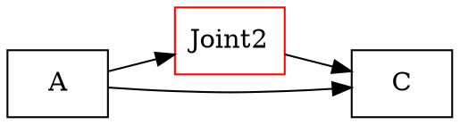

# GV 格式速查笔记

> Graphviz DOT 语言文件（`.gv` / `.dot`），由 `urdf_to_graphviz` 等工具生成，用于描述节点与边的关系图。

---

## 1. 环境（Ubuntu 24.04）

```bash
# 安装 Graphviz 命令行工具
sudo apt update
sudo apt install graphviz

# 验证安装
dot -V
```

---

## 2. 查看 GV 文件的方法

### 方法 A：命令行生成图片（推荐）

```bash
# PNG（通用）
dot -Tpng robot.gv -o robot.png

# SVG（矢量，可缩放）
dot -Tsvg robot.gv -o robot.svg

# PDF
dot -Tpdf robot.gv -o robot.pdf
```

### 方法 B：VS Code 实时预览

1. 安装扩展：**Graphviz Interactive Preview**（作者：tintinweb）
2. 打开 `.gv` 文件 → 右上角点击预览图标，或按 `Ctrl+Shift+P` → `Graphviz: Open Preview`
3. 支持交互：缩放、平移、导出 PNG/SVG

### 方法 C：Python 脚本转换

```bash
pip install graphviz
```

```python
from graphviz import Source

with open("robot.gv", "r") as f:
    src = Source(f.read())

src.render("robot", format="png", cleanup=True)  # 输出 robot.png
```

### 方法 D：在线工具（免安装）

- [Graphviz Online](https://dreampuf.github.io/GraphvizOnline)
- [Edotor](https://edotor.net)

---

## 3. GV 基本语法结构



### 常用属性速查

| 属性      | 说明                       | 示例                                  |
| --------- | -------------------------- | ------------------------------------- |
| `rankdir` | 图方向 `TB`/`LR`/`BT`/`RL` | `rankdir=LR;`                         |
| `shape`   | 节点形状                   | `box`, `ellipse`, `circle`, `diamond` |
| `label`   | 显示文字                   | `label="base_link"`                   |
| `color`   | 边框/线条颜色              | `color=blue`                          |
| `style`   | 样式                       | `filled`, `dashed`, `dotted`          |
| `bgcolor` | 背景色                     | `bgcolor=gray95`                      |

---

## 4. ROS2 URDF 生成 GV 的常用命令

```bash
# 从 URDF 生成 GV（需先 source ROS2 环境）
urdf_to_graphviz robot.urdf

# 输出文件：robot.gv（图描述）和 robot.pdf（自动渲染）
# 若未自动出图，手动执行：
dot -Tpng robot.gv -o robot.png
```

---

## 5. 常见问题

| 问题                     | 解决                                        |
| ------------------------ | ------------------------------------------- |
| `dot: command not found` | `sudo apt install graphviz`                 |
| 中文乱码                 | 节点加 `fontname="Noto Sans CJK SC"`        |
| 图太大看不清             | 用 SVG 格式或加 `ratio=auto; size="20,20";` |

---

> **一句话总结**：`.gv` 是文本图描述文件，Ubuntu 上装 `graphviz` 后用 `dot -Tpng` 转图片，或在 VS Code
> 装 **Graphviz Interactive Preview** 直接预览。
